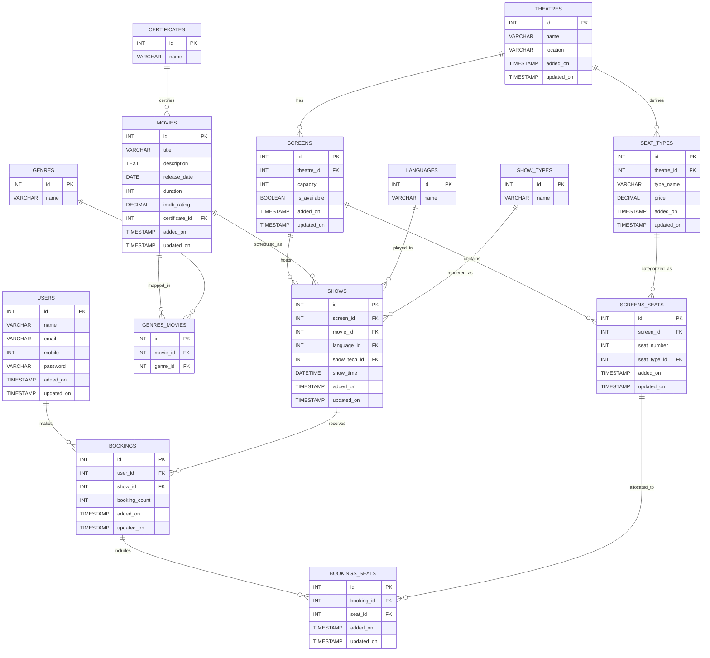

# BookMyShow SQL Assignment

This project defines a relational schema for a simplified movie-ticket booking system and adds sample data for testing joins.

## Included Database Objects

- 14 tables: users, genres, certificates, movies, genres_movies, theatres, screens, seat_types, screens_seats, languages, show_types, shows, bookings, bookings_seats
- Seed data for users, movies, theatres, screens, seat types, shows, and bookings
- A sample reporting query for listing shows by theatre and date

## ER Diagram (Mermaid)



## Sample Join Query (Theatre + Date)

```sql
SELECT
    t.name AS theatre_name,
    s.id AS screen_id,
    sh.id AS show_id,
    m.title AS movie_title,
    c.name AS certificate_name,
    l.name AS language,
    st.name AS show_tech,
    sh.show_time
FROM theatres t
JOIN screens s ON t.id = s.theatre_id
JOIN shows sh ON s.id = sh.screen_id
JOIN movies m ON m.id = sh.movie_id
JOIN certificates c ON c.id = m.certificate_id
JOIN languages l ON l.id = sh.language_id
JOIN show_types st ON st.id = sh.show_tech_id
WHERE t.id = 1
  AND sh.show_time BETWEEN '2026-04-27 00:00:00' AND '2026-04-27 23:59:59'
ORDER BY sh.show_time;
```

## Run Script

```sql
SOURCE book_my_show.sql;
```

